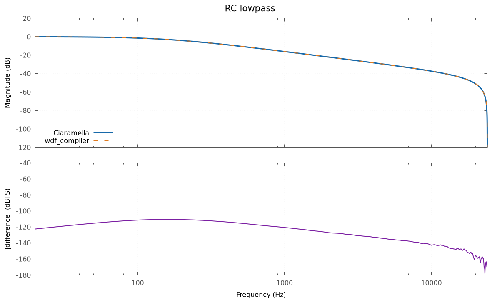
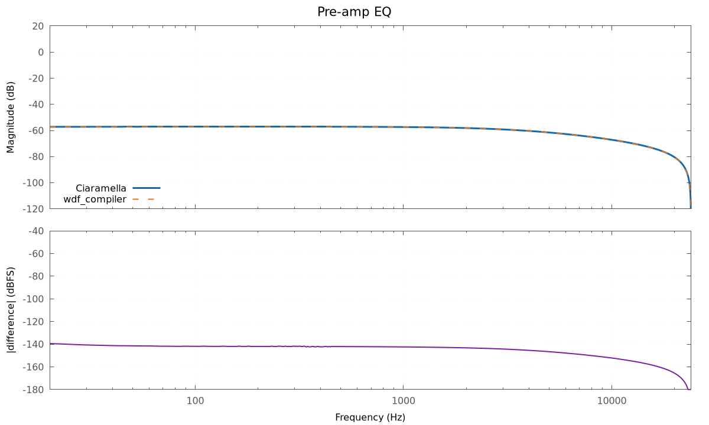
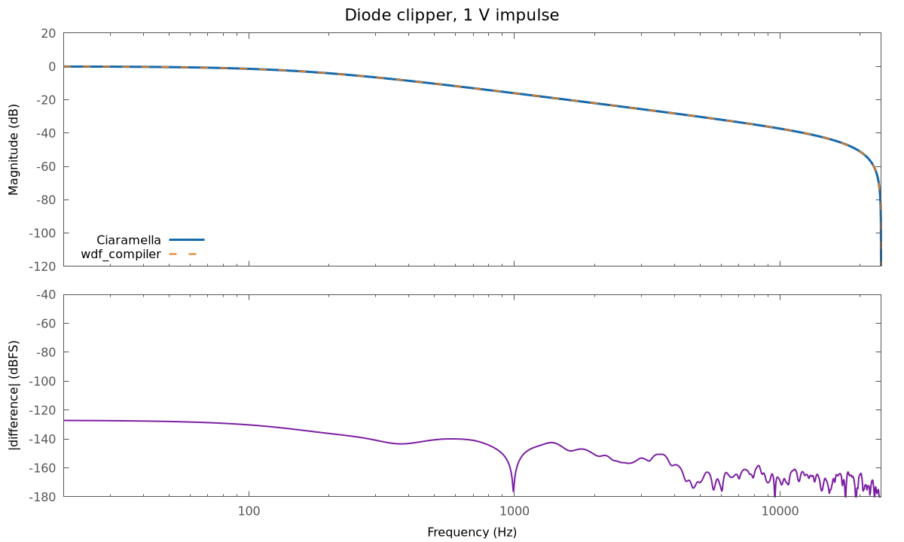
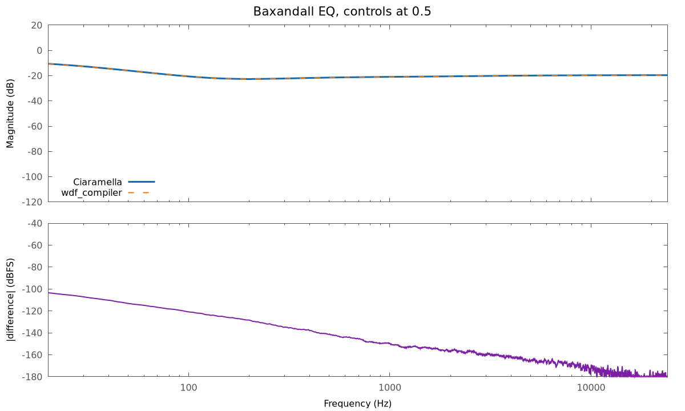

# Ciaramella / wdf_compiler comparison

The four circuits from [Performance-Oriented Wave Digital Circuit Emulation](https://dafx26.mit.edu/assets/papers/DAFx26_paper_23.pdf), implemented in Ciaramella.

`crm/` contains each Ciaramella source, its external bindings when needed, and generated C++. `reference/` is an ignored sparse checkout containing the matching upstream circuits and runtime support; `prepare.sh` downloads it at the pinned commit on first use. Benchmark sources live separately in `benchmark/`.

```text
crm/         Ciaramella sources and generated C++
reference/   downloaded wdf_compiler reference
benchmark/   comparison runners
plots/       generated frequency-response PNGs
build/       ignored binaries and intermediate data
```

From this directory:

```sh
./prepare.sh
./benchmark.sh [samples] [runs]
```

`benchmark.sh` also builds when needed. Before timing, each circuit checks 8192 deterministic samples and fails if the maximum error exceeds `1e-5`. The defaults are 10 million samples and 7 runs.

The scripts default to Clang with ThinLTO. Set `CXX`, use `WDF_BENCH_LTO=0` when LLD is unavailable, or `WDF_BENCH_PLOTS=0` to skip plotting. The first build needs Git and network access; later builds use `reference/`. Frequency plots require Python 3 and gnuplot.

The diode functions and Baxandall scattering coefficients are external symbols. Their C++ bindings live beside the corresponding `.crm`; target-specific implementations can replace them.

## Preliminary benchmark

Local snapshot from 2026-10-09: Intel i9-14900KF, one pinned P-core, Clang 21.1.8, `-O3 -march=native` and ThinLTO. Each value is the median of three complete executions; each execution reports the best of seven runs over 10 million samples.

| Circuit | Ciaramella | wdf_compiler | Ratio Ciaramella / reference |
|---|---:|---:|---:|
| RC lowpass | 3.00 ns/sample | 2.61 ns/sample | 1.15 |
| Pre-amp EQ | 10.50 ns/sample | 11.32 ns/sample | 0.93 |
| Diode clipper | 22.42 ns/sample | 21.88 ns/sample | 1.03 |
| Baxandall EQ | 10.76 ns/sample | 11.70 ns/sample | 0.92 |

A ratio below 1 favors Ciaramella. These are machine-specific preliminary numbers. All output checks passed; the largest sample error was `9.54e-7`.

## Frequency responses

Magnitude from a 16384-sample unit impulse at 48 kHz. The lower panels show the complex difference between implementations. For the nonlinear diode clipper this is a level-dependent measurement, not a linear transfer function.

| RC lowpass | Pre-amp EQ |
|---|---|
|  |  |

| Diode clipper | Baxandall EQ |
|---|---|
|  |  |
